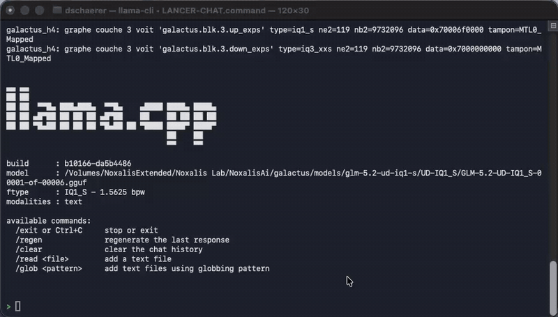
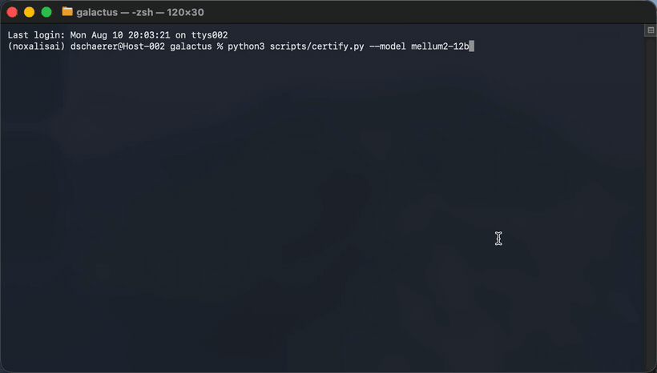
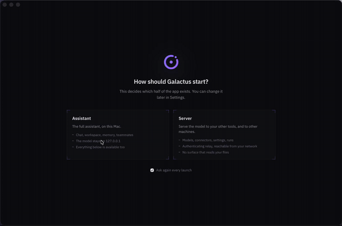
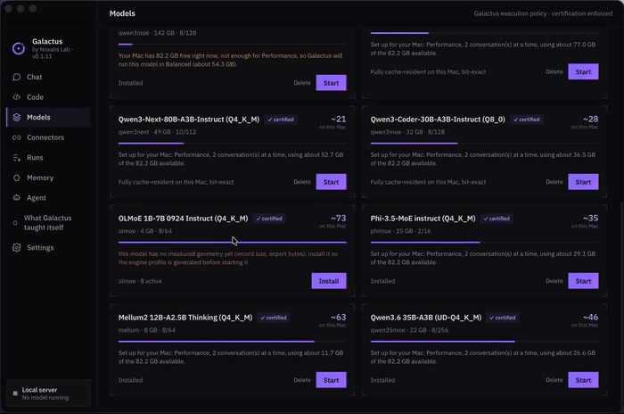
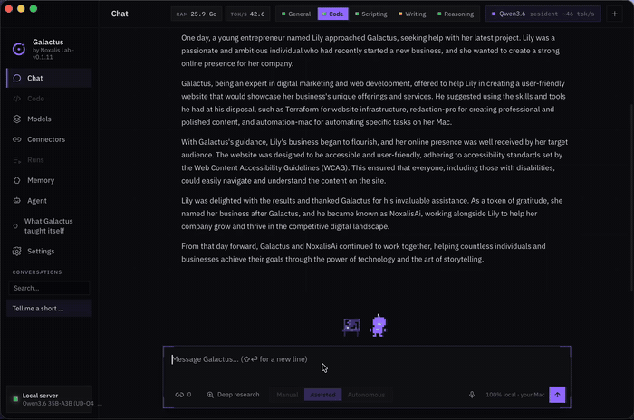
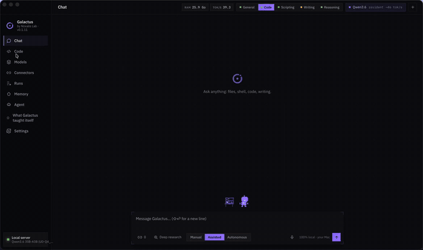
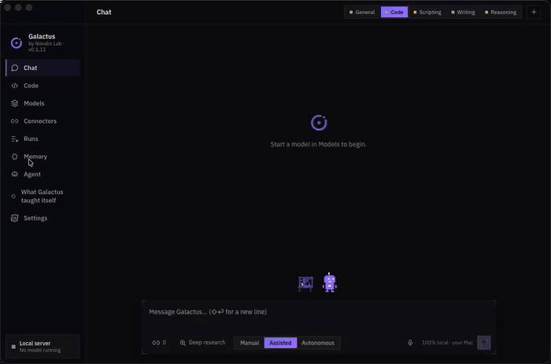

# Galactus, your RAM stops being the limit

    

A local AI app for macOS that runs Mixture-of-Experts models **several times larger than your Mac's memory**, at usable speed, with output identical bit for bit to stock llama.cpp.

A 65 GB model on a 16 GB Mac. A 142 GB model on 24 GB. The full 744-billion-parameter GLM-5.2, unpruned, on a 128 GB laptop.



*Live chat, no cherry-picking, the timing lines are llama.cpp's own. Thinking mode works too: [demo (2.5x speed)](docs/media/demo-thinking.gif).*

---

## The concept

A Mixture-of-Experts model is enormous on disk but frugal per token: of its hundreds of experts, the router picks a handful for each token. GLM-5.2 weighs 744 billion parameters and activates about 40 billion of them at a time. The weights you need at any instant are a small fraction of the weights you own.

Every runtime still asks you to hold all of them in RAM. That is the constraint Galactus removes.

The routed experts are repacked out of the GGUF into contiguous, aligned records on SSD. A pinned arena in RAM holds a per-layer cache of expert slots, and a graph node inserted after the router rewrites expert ids into slot ids: hits cost nothing, misses stream from the SSD into their slot before the matrix multiply runs, and the multiply reads the arena directly with zero copies. Your RAM becomes a cache, not a floor.

The cache is elastic. Give it 5.06 GB and gpt-oss-120b answers at 3.2 tok/s; give it 60.9 GB and the same model reaches 20.6. Nothing is pruned, quantized further, or dropped at any point along that curve. **The model you run is the model that was published, and its output is bit-identical to running it the ordinary way.**

That last point is not a slogan. A differential probe fingerprints every MoE tensor over a full perplexity run and finds zero divergence against stock llama.cpp. The GPU path is held to the same standard: the Metal expert kernels replicate the CPU integer pipeline exactly, verified across all 11 expert quantization types in the catalog, 32768 of 32768 bits identical per type, maximum absolute difference 0.0.



*`certify.py` on Mellum2: every MoE tensor compared, zero divergence, identical perplexity. 2x.*

### What that buys, measured

Every throughput below was measured on real hardware and lives in the model registry the app reads at runtime. One entry carries no curve yet, GLM-5.2 744B, which has a single measured point: it is certified bit-transparent, which is a different claim and the one that gates availability. Minimum RAM is what the app will let you install on, derived from measured resident footprint, not from arithmetic.

| model | on disk | min RAM | measured throughput |
|---|---|---|---|
| GLM-5.2 744B (UD-IQ1_S) | 202 GB | 128 GB | 5.9 tok/s at 92 GB cache |
| Qwen3-235B-A22B (Q4_K_M) | 142 GB | 24 GB | 0.6 tok/s at 12.5 GB, 1.0 at 24.2, 2.4 at 44.8 |
| GLM-4.5-Air 106B (Q4_K_M) | 73 GB | 32 GB | 1.8 tok/s at 11.8 GB, 3.4 at 33.6, 15.4 at 66 |
| gpt-oss-120b | 65 GB | 16 GB | 3.2 tok/s at 5.06 GB, 6.0 at 24.8, 20.6 at 60.9 |
| Llama-4 Scout 17B-16E (Q4_K_M) | 65 GB | 24 GB | 2.8 tok/s at 9.59 GB, 10.0 at 32.6, 12.4 at 58.5 |
| Qwen3-Next-80B-A3B (Q4_K_M) | 48 GB | 16 GB | 9.3 tok/s at 9.05 GB, 17.8 at 25.2, 18.2 at 46.9 |
| Qwen3-30B-A3B (Q8_0) | 32 GB | 16 GB | 7.1 tok/s at 9.07 GB, 25.5 at 22.4, 26.9 at 30.8 |
| Qwen3-Coder-30B (Q8_0) | 32 GB | 16 GB | 4.3 tok/s at 9.07 GB, 27.9 at 22.4, 28.5 at 30.8 |
| Phi-3.5-MoE instruct (Q4_K_M) | 25 GB | 16 GB | 13.2 tok/s at 10.1 GB, 22.7 at 22.4, 23.8 at 24.4 |
| OLMoE 1B-7B 0924 (Q4_K_M) | 4 GB | 16 GB | 11.0 tok/s at 0.98 GB, 52.4 at 2.93, 77.2 at 3.9 |
| Qwen3.6 35B-A3B (UD-Q4_K_M) | 22 GB | 16 GB | 37.2 tok/s at 2.45 GB, 41.2 at 7.8, 46.1 at 19.57 |
| Mellum2 12B-A2.5B Thinking (Q4_K_M) | 8 GB | 16 GB | 42.1 tok/s at 1.85 GB, 55.4 at 5.56, 62.6 at 7.41 |

Read the second and third columns together: a 142 GB model is usable on a 24 GB Mac, a 65 GB model on 16 GB. The app picks the regime for your machine on its own, every expert resident when the cache fits them all, streamed from SSD when it does not, or CPU experts for counter-verification. **All three regimes are bit-exact.** There is no fast-but-approximate mode, because a mode that changes the answer is not the same model.

---

## The app

A native macOS app for Apple Silicon, self-contained. The patched engine and its libraries, a private Python 3.12 runtime, the on-device dictation and document helpers, the model registry, 30 skills and a 50-note starter vault all ship inside the bundle. No Homebrew, no Python install, no account.

**What reaches the network, precisely.** No telemetry, no analytics, no account, no phone-home of any kind. Inference is always local. One connection is opened on the app's own initiative, and only one: eight seconds after launch, in assistant mode, Galactus asks GitHub whether a newer version exists. It sends nothing but the request, downloads nothing, and a settings row turns it off. Server mode never checks at all, because an offer on a screen nobody watches can only get an accidental answer. The answer to your question is computed on your Mac and nowhere else. Three things do reach the internet, and each one only because you asked for it: downloading a model from Hugging Face when you install it; the agent fetching a page, running deep research, or executing a shell command that you allowed, each shown as a tool card with the exact URL or command before it runs; and any MCP connector you enable, which fetches its own server package. Turn none of them on and the app is fully offline. That is a weaker claim than "nothing ever leaves your Mac", and it is the true one.

Grab `Galactus_x.y.z_aarch64.dmg` from the Releases page, drag it to Applications, launch it.



*The app on this Mac, at 2x.*

### Models that fit, told honestly

The catalog shows what actually runs on **your** Mac, with speeds interpolated from the measured curves above rather than from marketing. A model your machine cannot hold is not offered, and the card says why instead of failing at load time.

Installing a large model offers a mono or dual-SSD layout. The app detects candidate volumes, measures each drive's real sequential throughput with cache-bypassing reads, and shows the verdict before you confirm: striping across both when both pull their weight, mono on the fast drive when the slow one would bottleneck the pair. Deleting is symmetric and conservative, packs living outside the app's own store are spared and reported rather than silently removed.



*Installing a model: download, profile, plan, pack. Nothing is typed. 6x.*

### An agent, not a textbox

The chat is a full agent loop with three autonomy levels, manual, assisted and autonomous, cycled with Shift+Tab. It reads and writes files, runs commands, browses documents, searches its local knowledge base, calls skills, and delegates to teammates. Every file write shows a git-style diff in its tool card, including auto-approved ones, and permission prompts carry the diff before you allow anything.



*Nothing runs unasked: the diff is on screen before you allow it. 4x.*

**Teams of sub-agents.** The agent can spawn teammates, brief them, and ask them questions. Each teammate gets a clean context and **its own visible thread**, so a team of engineers working in parallel is something you read, not something you infer from a summary. Delegation depth is bounded and cycles are refused.

While the model is writing you keep typing. Messages queue, appear in the thread immediately, and run turn by turn. Context is managed adaptively: large tool outputs spill to scratch files the model rereads on demand, knowledge-base results are fitted to a token budget computed from the live window, and long threads are summarized by the model itself before the window overflows. Conversations do not die at the context edge, and they survive a restart.



*The agent in the Code view, reading and patching. 6x.*

### The Code view

Open a folder and the app becomes an editor with the same agent thread beside it. Everything the model writes inside that folder is a **proposal**: a pending diff you accept or reject hunk by hunk. Only accepted hunks are ever written, and nothing reaches the disk any other way.

Code intelligence ships in tiers, and the file header says which one you are getting, per file, live:

| tier | what you get | where |
|---|---|---|
| **Full** | types, hover, go to definition, references, rename | JavaScript and TypeScript, from the TypeScript language service running inside the app, in a worker |
| **Syntax** | outline, breadcrumb, syntax errors, project search, symbol palette | Python, Rust, JSON, Markdown, HTML, CSS, from the bundled Lezer grammars. Python additionally gets exact `SyntaxError` and an exact outline from the bundled CPython 3.12 |
| **Plain** | line numbers, search, undo | anything with no bundled grammar |

**Rust gets Syntax only today.** rust-analyzer and the standard library sources ship inside the bundle, but the Code view does not drive them yet, so a `.rs` file gets the Lezer grammar and nothing more. C is not supported at all, there is no bundled C grammar, so a `.c` or `.h` file opens as plain text. No language server is ever downloaded behind your back: the app ships what it ships, and the badge states the limit instead of hiding it.

Project search, the file palette (`Cmd+P`), the symbol palette (`Shift+Cmd+O`) and project-wide search (`Shift+Cmd+F`) are native Rust, no index daemon, no crate added.

**Version control** runs through your real `git`: history, diffs, per-file changes, staging, commit, push, pull, branches and checkout, all in the side panel. When this Mac has no `git`, the panel says so and never raises Apple's Command Line Tools installer.

### Knowledge, Obsidian and the vault

A local BM25 index turns any folders you pick into a searchable knowledge base, and results are fitted to a token budget computed from the live context window, whole entries only, with the omission reported rather than a truncated hit passed off as complete.

The app ships **a 50-note starter vault**, seeded on first launch and never overwritten afterwards: conventions, working practices, and trade-specific notes. Connect it, or your own Obsidian vault, and the agent reads and writes notes with the same diff discipline. The Constellation view renders the vault's wikilink graph as a navigable 3D starfield, click a star to read or edit the note.



*The starter vault as a graph, 50 notes and 255 links, a note opened from it, and the page that owns all of it: persistent memory with its scope, the folders indexed for offline search, and the vault read and written in place. 2x.*

> *Video placeholder: dictating a question and hearing the answer spoken back.*

### Skills

Thirty packaged skills are callable from the composer with `/`, covering development (senior dev, code review, methodical debugging, refactoring, writing tests, API design, SQL, regular expressions, git surgery), operations (Docker, Kubernetes, Terraform, remote servers over SSH, production incidents, log analysis, performance profiling), data and AI, and professional work (document analysis, sourced research, professional writing, technical translation, meeting minutes, spreadsheets, LaTeX, accessibility, UI/UX, portfolio tracking, sensitive data, mac automation, local prompting). A one-shot deep-research arm sits alongside them.

Each is a procedure with commands and a verification step, sized for a small context window. Provenance and licences for the adapted ones are in `docs/skills-sources.md` and `NOTICE`.

### Voice

Dictation is on-device, using macOS speech recognition, streaming partials into the composer as you speak. Answers can be spoken back.

### Connectors and local API

MCP connectors plug external tools into the agent, a knowledge-graph memory server ships preconfigured and custom servers are a form away. The running model is also exposed as a local OpenAI-compatible endpoint at `http://127.0.0.1:<port>/v1`, so any other client on your machine can use it while the app is up. Live RAM footprint and tokens per second sit in the header, and a one-click bench measures the running model with the server's own timings.

### Server mode

Galactus starts in one of two modes, chosen in settings. **App** is the assistant. **Server** is the same engine with the conversation, workspace, memory and agent surfaces gone: someone running Galactus to serve a model to their editor has no use for a chat pane, and every surface that reads files is one more thing to reason about on a machine that is now listening on the network.

The relay answers on port 8788 and can bind beyond the loopback. Binding to `0.0.0.0` requires an API key, generated on the spot from 256 bits of `/dev/urandom` and **never written to disk**: a key at rest in a settings file is a key in every backup and every sync folder, so it is shown once and held in memory while the screen is open. Bearer tokens are compared in constant time and the relay refuses to start with an empty key.

The settings screen prints ready-to-paste configuration generated from the live relay state, so the host and port are the ones actually listening: a `curl` call, the three plain values Cursor and Continue ask for, the `language_models` block for Zed, and the two environment variables any OpenAI SDK reads, which is how an Obsidian plugin is pointed at it.

### Unattended runs

A machine serving a model with nobody in front of it can be given a task and left alone. A **run** is a named task with a policy, a turn budget and a wall clock, all fixed before the first token.

Three policies, and the list is closed on purpose, because the alternative is an interface where the dangerous configuration and the safe one look alike. `read_only` looks and never touches. `propose` adds web retrieval and code proposals, which land in the editor as pending diffs and only reach the disk when a human accepts a hunk. `autonomous` covers every ordinary permission.

Elevated requests are refused under all three, with no value that unlocks them. A refusal does not stop the run: the model is told no and carries on, exactly as when a human presses Deny, because stopping there would turn every elevated attempt into a dead task.

Under `autonomous`, exactly two things could still stop a run: `git push` and `git pull`, which the attended gate shows every time so the user sees the branch and the count. Nobody is watching a run, so a **stop is a failure of the design, not a safety feature**: a task that waits for a click is not automated. The declaration form answers those two in advance, which is where the decision belongs in an automated system, made once by someone who knows what the run is for rather than paged mid-turn to approve a branch name out of context. It reaches nothing else: elevated is refused before it is consulted, a kind outside the policy is refused before it too, so under `read_only` it changes nothing at all. It is part of the frozen limits and of the transcript's first entry, so a run cannot acquire it afterwards and a snapshot claiming it against a transcript that does not is refused.

Under the two narrower policies, a run does stop on anything outside its grants, which is the point of choosing them: it records what it is waiting for and resumes where it left off. Granting it then is scoped to that one kind and that one path, is stored in the run's own append-only transcript rather than in a settings field, and overrules the policy alone: a cancelled run and a run past its wall clock stay refused whatever anyone granted them.

The run's agent never writes a standing rule, under any policy. A rule written by a run nobody was watching would outlive it and pre-approve the same action in a later session, in another project.

### The command line

The same binary doubles as a CLI, sharing the app's exact engine logic, regimes and pack resolution:

```bash
galactus models                   # catalog with install status
galactus install <model>          # download + profile + plan + pack
galactus serve <model>            # local OpenAI-compatible API
galactus bench                    # tok/s of the running server
galactus history search <terms>   # search saved conversations
galactus remove <model>           # delete, confirmed by typing the name
galactus status | stop
```

`serve` accepts `--ram eco|balanced|perf`, `--cpu-moe`, `--slots N` and `--port N`, and prints the chosen regime and the pack layout before the endpoint comes up.

> *Video placeholder: a CLI session, help, catalog and server state.*

---

## The engine

Everything below is the raw engine the app drives, measured and reproducible without it.

### Highlights

- **Full checkpoint.** Every layer, every expert. No pruning, no expert dropping, no distillation.
- **6x over naive streaming.** `mmap` streaming runs GLM-5.2 at 1.0 tok/s on this machine; Galactus reaches 5.9 measured end to end, 6.4 warm, against a measured hardware ceiling of 8.04.
- **Bit-transparent quality.** A differential probe fingerprinting every MoE tensor over a full perplexity run finds zero divergence against stock llama.cpp on the CPU expert path.
- **Bit-exact Metal experts.** The GPU expert path replicates the CPU integer pipeline bit for bit for all 11 expert quant types in the catalog.
- **Tiny integration surface.** Two source files plus a small patch over 8 llama.cpp files, everything gated behind environment variables. Without them the binary is byte-identical to upstream.
- **Every number is reproducible.** Each figure in this README maps to a script in `lanceurs/` that replays the measurement, guards included.

### Numbers

Measured on a MacBook Pro (Apple M5 Max, 128 GB unified memory), internal Apple SSD plus a Lexar NM790, packs striped across both at 15.2 GB/s sustained. Same corpus, same seed everywhere.

| configuration | throughput | perplexity |
|---|---|---|
| stock llama.cpp (reference) | | 2.6373 |
| naive `mmap` streaming | 1.0 tok/s | 2.6373 |
| layer-granular offload (`-ncmoe`), ceiling | 4.94 tok/s | 2.6373 |
| **galactus, CPU experts** | **5.9 tok/s** (6.4 warm) | 2.6439 (75 layers), 2.6373 bit-exact (per layer) |
| hardware ceiling (closed model) | 8.04 tok/s | |

The 8.04 ceiling is not a guess: a three-constant model (expert bytes per token, storage throughput, compute time) predicts throughput within 1% across four independent cache sizes. It also proves 15 tok/s would need roughly 200 GB of RAM, see `docs/PHYSICAL-MODEL.md`.

The Metal expert path used to trade precision for speed, with measured drift per quant class between -0.24% and +1.79%. That trade is gone. Under `GALACTUS_METAL_BITEXACT=1` the `mul_mat_id` kernels replicate the CPU algorithm exactly, same Q8 activation quantization, same integer dot products, same summation order, fast-math reassociation fenced off, and a dedicated parity probe confirms bit-identity on every expert quant type. The app runs this path by default; without the variable the kernels are byte-identical to upstream.

### How it works

```
GGUF (202 GB, 6 shards)                    2 x NVMe packs (197.6 GB)
   |  non-expert weights (15.6 GB)            |  19,200 expert records,
   v                                          |  contiguous, 16 KiB-aligned
llama.cpp ---------> RAM                      v
   |                              pinned arena (up to ~92 GB)
   |  router picks 8 experts         ^ per-layer SLRU cache
   v                                 | pread + F_NOCACHE on miss
remap node: expert id --> arena slot -+
   v
mul_mat_id reads the arena directly (nb[2] = pack record stride, zero copy)
```

1. **Packs.** The 19,200 routed experts (75 layers x 256) are repacked out of the GGUFs into two files, one per SSD, one contiguous record per expert. The cut point between volumes comes from each drive's measured throughput.
2. **Resident store.** A pinned arena holds a per-layer quota of expert slots. A per-layer SLRU decides who stays, benchmarked against W-TinyLFU, windowed LFU and global SLRU; recency dominates this workload and per-layer SLRU wins.
3. **Zero-copy wiring.** Expert tensors are created with the arena's record stride and backed directly onto it. The GGUF is never read for routed experts.
4. **Remap and serve.** A graph node after the router rewrites expert ids into slot ids and synchronously serves the layer. Cache hits cost nothing, misses stream from the packs into their slots before `mul_mat_id` runs.

### Engine quickstart, without the app

You need the GLM-5.2 UD-IQ1_S GGUFs (about 202 GB) and two fast SSDs.

**1. Build llama.cpp with the patch**

```bash
git clone https://github.com/ggml-org/llama.cpp third_party/llama.cpp
cd third_party/llama.cpp && git checkout $(cat ../../patches/UPSTREAM-COMMIT.txt)
../../patches/appliquer.sh .
cmake -B build -DGGML_METAL=ON && cmake --build build -j
```

**2. Build the expert packs**, one time, about 200 GB written, each output on its own SSD

```bash
# plan: maps every expert record to its GGUF source spans
python3 scripts/h4-pack-plan.py --model-directory /path/to/UD-IQ1_S --output plan.json

# packs: fixture mode first (3 records, seconds) to validate the chain end to end
python3 scripts/h4-pack-write.py --mode fixture --plan plan.json \
  --expected-plan-sha256 $(shasum -a 256 plan.json | cut -d' ' -f1) \
  --model-directory /path/to/UD-IQ1_S --manifest manifest.json \
  --fixture-output-directory /tmp/fixture

# then the real thing (the confirmation string is printed by the tool)
python3 scripts/h4-pack-write.py --mode full --plan plan.json \
  --expected-plan-sha256 $(shasum -a 256 plan.json | cut -d' ' -f1) \
  --model-directory /path/to/UD-IQ1_S --manifest manifest.json \
  --internal-output-directory /Volumes/InternalSSD/GalactusH4 \
  --external-output-directory /Volumes/ExternalSSD/GalactusH4 \
  --confirm-full-pack WRITE-CONTRESIGNED-H4-P0V2-19200
```

**3. Run**

```bash
GALACTUS_H4=1 \
GALACTUS_H4_INTERNAL=/Volumes/InternalSSD/GalactusH4/h4-p0v2-internal.pack \
GALACTUS_H4_EXTERNAL=/Volumes/ExternalSSD/GalactusH4/h4-p0v2-external.pack \
GALACTUS_H4_CACHE_BYTES=92000000000 \
build/bin/llama-cli --model GLM-5.2-UD-IQ1_S-00001-of-00006.gguf \
  --ctx-size 4096 -ngl 99 --no-repack --fit off --no-mmap -b 2 -ub 2
```

Or use `lanceurs/LANCER-CHAT.command` for an interactive session with sane defaults. Main knobs: `GALACTUS_H4_CACHE_BYTES` (resident cache size, throughput scales with it), `GALACTUS_METAL_BITEXACT=1` (bit-exact GPU experts, the app's default), `GALACTUS_H4_CPU_MOE=1` (bit-exact CPU experts, for counter-verification), `GALACTUS_H4_QD` (read queue depth, default 32).

### The cache plan

The resident cache used to give every MoE layer the same number of expert slots. The layers are not the same: replayed on real routing traces, qwen3-30b serves 45.7 % of layer 0's accesses from RAM and 85 to 92 % of the accesses of the deep layers, so a slot given to layer 0 removes several times more device reads than the same slot given to layer 20. A **cache plan** carries the miss curve of every layer, measured once from a recorded run, and the engine spends the *same* arena bytes where a slot removes the most reads. Nothing asks for more memory; the plan only moves slots between layers.

```bash
# once per model: record routes, then derive the plan beside its profile
GALACTUS_H4_ROUTES=routes.txt <a normal run>
python3 scripts/derive-cache-plan.py --routes routes.txt --out models/<model>/cache-plan.txt

# compare any policy against the current one, offline, on the recorded traces
python3 scripts/replay-cache.py --routes routes.txt --sweep --plan cache-plans/<arch>.txt
```

The plan is picked up automatically from `cache-plan.txt` beside the model profile, or from `GALACTUS_H4_CACHE_PLAN=<path>`. Plans for the architectures measured so far are in `cache-plans/`. `GALACTUS_H4_CACHE_POLICY` selects: `auto` (the default, plan plus frequency eviction), `uniform` (the policy that shipped before, unchanged), `plan`, or `frequency`. Measured on real traces at identical arena bytes, records reaching the SSD per token fall by 2.4 to 7.7 % at the smallest cache each model can run in, and by 5 to 34 % at the cache sizes shipped today. It is never worse at any cache size, and ties exactly when the whole model fits.

### The bug worth reading about

The first wired build produced fluent text, and a perplexity of 13.74 instead of 2.64. The hunt took a full day and four purpose-built instruments: layer bisection, a zero-eviction probe, a byte-level audit of 768 expert records against the GGUF, and a full-run differential fingerprint of every MoE tensor. Each cleared a suspect. The breakthrough came from a paradox, identical tensor dumps with different perplexities, which exposed the probe's own blind spot and, behind it, the real bug: `selected_experts` is a non-contiguous ggml view (`ggml_top_k`), and the remap read it linearly. Every token after the first in each micro-batch was silently routed to its neighbour's experts.

One stride-aware read later: 13.74 became 2.6439, and the differential probe now shows bit-identity. Full story in `docs/STUDY.md` section 7. The takeaway is engraved as a rule: *a ggml tensor is a view until proven otherwise, read through `nb[]`, never linearly.*

### Documentation

| | |
|---|---|
| `docs/STUDY.md` | complete study: hardware, method, all benchmarks, the bug hunt |
| `docs/PHYSICAL-MODEL.md` | the machine's closed physical model and its ceilings |
| `docs/skills-sources.md` | provenance and licences of the packaged skills |
| `patches/` | pinned llama.cpp diff and apply script |
| `lanceurs/` | the exact scripted runs behind every number above, by category |

### Adding another MoE model

This section used to be a work list of frozen constants and a fifteen-line
branch to write in each architecture's own file. That stopped being true, and
the claim was measured rather than argued: **two architectures this project had never
seen, `olmoe` and `phimoe`, each went from a download to a certified model with
no code change at all.** Profile, plan, pack, certify. The differential
came back with 5140 tensors identical, zero divergence, and a perplexity of
3.988 on both sides.

The engine hook lives in `llm_graph_context::build_moe_ffn`, the MoE graph
builder every architecture shares, plus an interception at tensor creation that
filters on the tensor NAME. Zero architecture files are touched: `glm-dsa.cpp`
contains no reference to Galactus. Record geometry comes from a profile read at
runtime, and expert keys are ten bits wide, so the old ceiling of 256 experts
per layer is gone.

So the work list is now three commands:

```bash
# Does the engine support this file at all? Reads the header over HTTP,
# a few megabytes, before you pull the weights.
python3 scripts/probe-gguf.py https://huggingface.co/.../model.gguf

python3 scripts/moe-profile.py --model-directory models/<id> --output models/<id>/profile.json
python3 scripts/galactus-pack-plan.py --profile models/<id>/profile.json --output models/<id>/plan.json --volumes single
python3 scripts/galactus-pack-write.py --plan models/<id>/plan.json --mode full ...

python3 scripts/certify.py --model <id>
```

The probe exists because of a real cost. A 26 GB Mixtral download finished
before anything reported that the file was unusable: TheBloke's 2023
quantization stores experts as 768 separate per-expert tensors, from before
llama.cpp merged them into fused `*_exps` tensors, and the engine intercepts
the fused ones. Every Mixtral GGUF checked afterwards, including a 2024
requantization, had the same layout. The answer was in the first few megabytes
the whole time, and the probe now reads exactly those.

**Certification is not optional and not a formality.** `certify.py` runs the
same corpus, the same seed and the same batch shape twice, once wired and once
stock, and compares the fingerprint of every MoE tensor of one layer byte for
byte. One differing line fails. It never runs above
`op_offload_min_batch_size`, which is 32: past that llama.cpp offloads to the
GPU, `--n-cpu-moe` stops being a CPU reference, and the comparison measures
nothing. That mistake invalidated a whole perplexity table here once, so the
micro-batch is a constant in the script with no flag to raise it, rather than a
value checked at run time. The perplexity it produces is stored with the corpus
file it read, that file's sha256, the seed and the batch shape, because a
perplexity without the text behind it is not evidence.

The economics still move. This approach pays when expert bytes dwarf RAM and
your storage is fast relative to `(model_bytes_per_token x miss_rate)`. The
closed model in `docs/PHYSICAL-MODEL.md` section 1 gives the formula: three
measured constants and you know your ceiling before writing a line.

### Limitations

Engineering for one machine and one model: the method transfers, the frozen constants do not. Interactive batch is capped at 2 by the cache residency bound. And 0.25% of perplexity on the 75-layer run remains unexplained while each layer alone is bit-transparent, an open item, documented.

The app is not notarized. It is signed ad hoc, so the first launch of a downloaded build goes through Gatekeeper's right-click and Open.

---

## Credits and license

Built by **Noxalis Lab**. Apache 2.0, see `LICENSE` and `NOTICE`: if you use Galactus, keep the credit visible.
